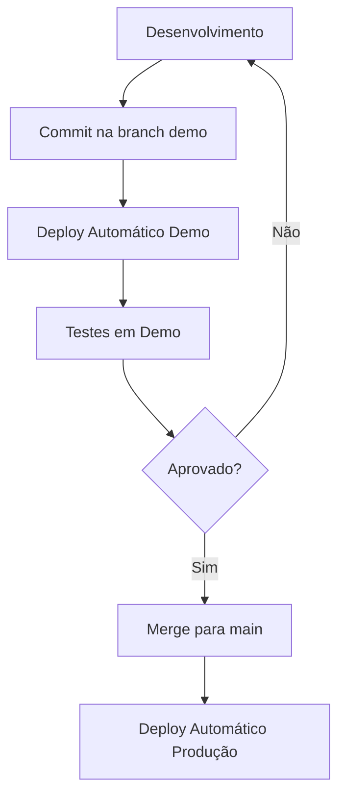

# Guia de Ambientes - MILAPP

Este projeto está configurado para trabalhar com **dois ambientes completamente separados**:

## 🏗️ Estrutura de Ambientes

### 1. **DEMO/HOMOLOGAÇÃO**
- **Branch**: `demo`
- **Supabase**: Projeto separado para testes
- **Build**: `npm run build:demo` → `dist-demo/`
- **Deploy**: Automático via GitHub Actions quando push na branch `demo`

### 2. **PRODUÇÃO**
- **Branch**: `main`
- **Supabase**: Projeto de produção (`ktuvnllzmpsdgstsgbib`)
- **Build**: `npm run build:prod` → `dist-prod/`
- **Deploy**: Automático via GitHub Actions quando push na branch `main`

## 🚀 Como Usar

### Desenvolvimento Local

```bash
# Para trabalhar com ambiente demo
npm run dev:demo

# Para trabalhar com ambiente produção
npm run dev:prod

# Desenvolvimento padrão (usa ambiente demo)
npm run dev
```

### Deploy Manual

```bash
# Deploy para demo
./deploy-demo.sh

# Deploy para produção
./deploy-prod.sh
```

### Builds Específicos

```bash
# Build para demo
npm run build:demo

# Build para produção
npm run build:prod
```

## 📋 Setup Inicial

### 1. Criar Projeto Supabase Demo

1. Acesse [Supabase Dashboard](https://supabase.com/dashboard)
2. Crie um novo projeto para **DEMO/HOMOLOGAÇÃO**
3. Atualize as credenciais em:
   - `src/config/environments.ts`
   - `src/lib/supabase-demo.ts`
   - `supabase-demo/config.toml`

### 2. Configurar GitHub

1. Crie a branch `demo`:
   ```bash
   git checkout -b demo
   git push -u origin demo
   ```

2. Configure os **Environments** no GitHub:
   - Settings → Environments
   - Crie "demo" e "production"
   - Configure secrets necessários

### 3. Configurar Deploy

1. Atualize os workflows em `.github/workflows/`
2. Configure seu provedor de hosting nos scripts de deploy
3. Teste os deploys:
   ```bash
   # Push para demo
   git checkout demo
   git push origin demo

   # Push para produção
   git checkout main
   git push origin main
   ```

## 🔄 Workflow de Desenvolvimento



## 📁 Estrutura de Arquivos

```
├── src/
│   ├── config/environments.ts          # Configuração dos ambientes
│   ├── lib/
│   │   ├── supabase.ts                # Cliente dinâmico
│   │   ├── supabase-demo.ts           # Cliente demo
│   │   └── supabase-prod.ts           # Cliente produção
├── supabase/                          # Produção
├── supabase-demo/                     # Demo
├── .github/workflows/
│   ├── deploy-demo.yml               # CI/CD Demo
│   └── deploy-production.yml         # CI/CD Produção
├── dist-demo/                        # Build demo
├── dist-prod/                        # Build produção
├── deploy-demo.sh                    # Script deploy demo
└── deploy-prod.sh                    # Script deploy produção
```

## 🔧 Configurações por Ambiente

| Configuração | Demo | Produção |
|--------------|------|----------|
| **Branch** | `demo` | `main` |
| **Supabase** | Projeto separado | `ktuvnllzmpsdgstsgbib` |
| **Build Dir** | `dist-demo/` | `dist-prod/` |
| **Sourcemaps** | ✅ Sim | ❌ Não |
| **Minificação** | Básica | Otimizada |
| **Badge Ambiente** | ✅ Visível | ❌ Oculto |

## 🚨 Importante

- **Nunca** faça deploy de produção diretamente
- **Sempre** teste primeiro no ambiente demo
- **Mantenha** as credenciais de cada ambiente separadas
- **Use** branches específicas para cada ambiente