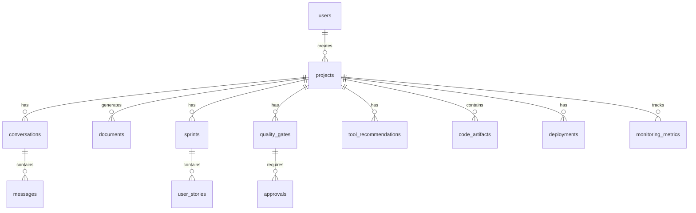

# MILAPP v2.0 - Documentação Técnica

## 📋 **Visão Geral da Arquitetura**

O MILAPP v2.0 é uma plataforma completa de gestão de Centro de Excelência (CoE) de Automação, construída com arquitetura moderna e tecnologias de ponta.

### **🏗️ Stack Tecnológico**

#### **Frontend**
- **React 18** - Framework principal
- **TypeScript** - Tipagem estática
- **Vite** - Build tool e dev server
- **shadcn/ui** - Componentes de interface
- **Tailwind CSS** - Framework CSS
- **React Query** - Gerenciamento de estado servidor
- **React Router** - Roteamento

#### **Backend**
- **FastAPI** - Framework web assíncrono
- **Python 3.11+** - Linguagem principal
- **SQLAlchemy** - ORM para banco de dados
- **Pydantic** - Validação de dados
- **Alembic** - Migrações de banco

#### **Database**
- **Supabase** - PostgreSQL como serviço
- **Redis** - Cache e sessões
- **MinIO** - Object storage (S3-compatible)

#### **IA/ML**
- **OpenAI GPT-4** - Modelos de linguagem
- **LangChain** - Framework de IA
- **Whisper** - Transcrição de áudio
- **OpenCV** - Processamento de imagens

#### **DevOps & Monitoring**
- **Docker** - Containerização
- **Docker Compose** - Orquestração local
- **Prometheus** - Métricas
- **Grafana** - Dashboards
- **GitHub Actions** - CI/CD

## 🗄️ **Estrutura de Banco de Dados**

### **Schema Principal: `milapp`**

#### **Tabelas Core**
- `users` - Usuários do sistema
- `projects` - Projetos de automação
- `conversations` - Conversas com IA
- `messages` - Mensagens das conversas
- `documents` - Documentos gerados (PDD, SDD, GMUD)

#### **Tabelas de Gestão Ágil**
- `sprints` - Sprints dos projetos
- `user_stories` - User stories/tickets

#### **Tabelas de Governança**
- `quality_gates` - Quality Gates G1-G4
- `approvals` - Aprovações dos gates

#### **Tabelas de Desenvolvimento**
- `tool_recommendations` - Recomendações de ferramentas RPA
- `code_artifacts` - Artefatos de código
- `deployments` - Deployments de automações

#### **Tabelas de Monitoramento**
- `monitoring_metrics` - Métricas de monitoramento
- `dashboards` - Dashboards personalizados

#### **Tabelas de Segurança**
- `permissions` - Permissões RBAC
- `audit_logs` - Logs de auditoria

### **Relacionamentos Principais**



## 🔌 **APIs e Endpoints**

### **Base URL**: `http://localhost:8000/api/v1`

#### **Autenticação**
- `POST /auth/login` - Login do usuário
- `POST /auth/refresh` - Renovar token

#### **Conversas IA**
- `POST /conversations/` - Criar conversa
- `POST /conversations/{id}/messages` - Enviar mensagem

#### **Projetos**
- `GET /projects/` - Listar projetos
- `POST /projects/` - Criar projeto
- `GET /projects/{id}/` - Obter projeto
- `PUT /projects/{id}/` - Atualizar projeto

#### **Documentos**
- `POST /documents/generate` - Gerar documento

#### **Quality Gates**
- `GET /quality-gates/` - Listar gates
- `POST /quality-gates/{project_id}` - Criar gate

#### **Deployments**
- `POST /deployments/` - Fazer deploy

#### **Dashboards**
- `GET /dashboards/` - Obter dados do dashboard

## 🤖 **Serviços de IA**

### **AIService**
Responsável por processar mensagens e conteúdo multimodal.

#### **Métodos Principais**
- `process_text_message()` - Processar mensagem de texto
- `analyze_multimodal_content()` - Analisar conteúdo multimodal
- `_analyze_image()` - Analisar imagens com OCR
- `_analyze_pdf()` - Analisar PDFs
- `_analyze_audio()` - Analisar áudio com transcrição

### **Integração com OpenAI**
- GPT-4 para processamento de linguagem natural
- Whisper para transcrição de áudio
- Análise de sentimentos e extração de entidades

## 🔐 **Segurança e Autenticação**

### **Autenticação**
- **JWT Tokens** - Access e refresh tokens
- **Azure AD** - Integração SSO (opcional)
- **Supabase Auth** - Autenticação nativa

### **Autorização**
- **RBAC** - Role-Based Access Control
- **Row Level Security** - Segurança no nível da linha
- **Políticas RLS** - Controle granular de acesso

### **Auditoria**
- **Logs completos** - Todas as ações são registradas
- **Audit trail** - Rastreabilidade completa
- **Compliance** - Conformidade com regulamentações

## 📊 **Monitoramento e Observabilidade**

### **Métricas**
- **Prometheus** - Coleta de métricas
- **Grafana** - Visualização de dashboards
- **Custom metrics** - Métricas específicas do MILAPP

### **Logs**
- **Structured logging** - Logs estruturados com structlog
- **Log levels** - Debug, Info, Warning, Error
- **Centralized logging** - Agregação de logs

### **Health Checks**
- **/health** - Verificação de saúde básica
- **/ready** - Verificação de prontidão
- **/metrics** - Endpoint Prometheus

## 🚀 **Deploy e Infraestrutura**

### **Desenvolvimento Local**
```bash
# Setup inicial
./setup.sh

# Ou manualmente
npm install
docker-compose up -d
```

### **Produção**
```bash
# Build das imagens
docker-compose -f docker-compose.prod.yml build

# Deploy
docker-compose -f docker-compose.prod.yml up -d
```

### **Kubernetes**
- Manifests disponíveis em `devops/kubernetes/`
- Helm charts em `devops/helm/`
- Configurações de monitoramento

## 🔧 **Configuração**

### **Variáveis de Ambiente**
Ver arquivo `env.example` para todas as variáveis disponíveis.

### **Configurações Importantes**
- `DATABASE_URL` - URL do banco PostgreSQL
- `OPENAI_API_KEY` - Chave da API OpenAI
- `JWT_SECRET_KEY` - Chave secreta para JWT
- `SUPABASE_URL` - URL do projeto Supabase

## 📈 **Performance e Escalabilidade**

### **Otimizações**
- **Connection pooling** - Pool de conexões do banco
- **Caching** - Redis para cache
- **Async processing** - Processamento assíncrono
- **CDN** - Content Delivery Network para assets

### **Métricas de Performance**
- **Response time** - < 200ms para APIs
- **Throughput** - 1000+ requests/minuto
- **Uptime** - 99.9% disponibilidade

## 🧪 **Testes**

### **Tipos de Testes**
- **Unit tests** - Testes unitários
- **Integration tests** - Testes de integração
- **E2E tests** - Testes end-to-end
- **Performance tests** - Testes de performance

### **Execução**
```bash
# Backend
cd backend
pytest

# Frontend
npm test
```

## 📚 **Documentação Adicional**

- **API Docs**: http://localhost:8000/docs
- **ReDoc**: http://localhost:8000/redoc
- **Supabase Studio**: http://localhost:54321
- **Grafana**: http://localhost:3001

## 🔄 **Roadmap**

### **Versão 2.1**
- [ ] Integração completa com Azure AD
- [ ] Processamento avançado de BPMN
- [ ] Dashboards executivos avançados
- [ ] Pipeline CI/CD completo

### **Versão 2.2**
- [ ] IA preditiva para ROI
- [ ] Integração com Power BI
- [ ] Mobile app PWA
- [ ] Machine Learning para otimização

### **Versão 3.0**
- [ ] Multi-tenancy
- [ ] Marketplace de automações
- [ ] IA generativa para código
- [ ] Integração com mais ferramentas RPA

---

**MILAPP v2.0** - Transformando a gestão de automação corporativa 