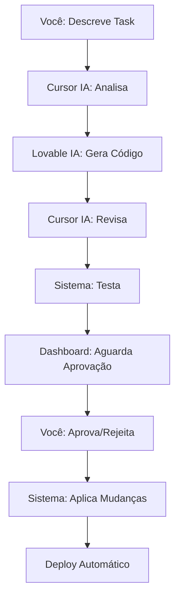

# 🤖 MILAPP - Pipeline de Integração IA-IA

Sistema de **integração automática** entre **Lovable IA** e **Cursor IA** que permite desenvolvimento autônomo com aprovação manual.

## 🎯 **Visão Geral**

Este pipeline permite que as duas IAs trabalhem em conjunto de forma autônoma:

1. **Cursor IA** analisa requisitos e contexto
2. **Lovable IA** gera código baseado na análise
3. **Cursor IA** revisa e refina o código
4. **Sistema** executa testes automatizados
5. **Você** aprova ou rejeita as mudanças
6. **Sistema** aplica mudanças e faz deploy automaticamente

## 🚀 **Como Funciona**

### **Fluxo Automático**



### **Interação Zero**

- **Sem intervenção manual** durante o processo
- **Apenas aprovação final** necessária
- **Feedback automático** para melhorias
- **Rollback automático** em caso de falha

## 📋 **Instalação**

### **1. Pré-requisitos**

```bash
# Python 3.8+
python3 --version

# Docker
docker --version

# Git
git --version
```

### **2. Configuração**

```bash
# Clonar repositório
git clone https://github.com/AutomacaoRPA/milapp-supabase-builder.git
cd milapp-supabase-builder

# Configurar variáveis de ambiente
cp env.example .env
# Editar .env com suas API keys
```

### **3. Iniciar Pipeline**

```bash
# Dar permissão de execução
chmod +x ai-pipeline/start-pipeline.sh

# Iniciar pipeline
./ai-pipeline/start-pipeline.sh
```

## 🎮 **Como Usar**

### **1. Acessar Dashboard**

Abra o navegador em: `http://localhost:8501`

### **2. Configurar APIs**

No dashboard, vá em **⚙️ Configurações** e configure:
- **Lovable IA API Key**
- **Cursor IA API Key**
- **Deploy API Key**

### **3. Criar Nova Task**

1. Vá em **🚀 Iniciar Nova Task**
2. Descreva o que você quer implementar
3. Selecione o tipo de task
4. Clique em **Iniciar Pipeline IA-IA**

### **4. Aprovar Mudanças**

1. Vá em **📋 Fila de Aprovação**
2. Revise as mudanças geradas
3. Analise testes e qualidade
4. Clique em **✅ Aprovar** ou **❌ Rejeitar**

## 🔧 **Configuração Avançada**

### **Variáveis de Ambiente**

```bash
# APIs das IAs
LOVABLE_API_KEY=your_lovable_api_key
CURSOR_API_KEY=your_cursor_api_key

# Deploy
DEPLOY_API_KEY=your_deploy_api_key
DEPLOY_URL=https://deploy.milapp.com

# Cache e Performance
REDIS_URL=redis://localhost:6379/0

# Segurança
ENCRYPTION_KEY=your_encryption_key

# Notificações
SMTP_HOST=smtp.company.com
SMTP_USER=milapp@company.com
SMTP_PASSWORD=your_password
SLACK_WEBHOOK_URL=https://hooks.slack.com/...
TEAMS_WEBHOOK_URL=https://outlook.office.com/webhook/...
```

### **Configuração de Qualidade**

No arquivo `ai-pipeline/config.yaml`:

```yaml
quality:
  min_score: 70                    # Score mínimo para aprovação
  require_tests_passing: true      # Exigir testes passando
  require_security_scan: true      # Exigir scan de segurança
  test_coverage_minimum: 80        # Cobertura mínima de testes
  security_score_minimum: 90       # Score mínimo de segurança
```

## 📊 **Monitoramento**

### **Logs**

```bash
# Dashboard
tail -f logs/dashboard.log

# Orquestrador
tail -f logs/orchestrator.log

# Pipeline geral
tail -f logs/ai-pipeline.log

# Auditoria
tail -f logs/audit.log
```

### **Métricas**

- **Taxa de aprovação**
- **Tempo médio de processamento**
- **Qualidade do código gerado**
- **Performance dos testes**

## 🔒 **Segurança**

### **Recursos de Segurança**

- ✅ **Criptografia** de API keys
- ✅ **Auditoria completa** de todas as ações
- ✅ **Rate limiting** para APIs
- ✅ **Scan de segurança** automático
- ✅ **Backup automático** antes de mudanças
- ✅ **Rollback automático** em caso de falha

### **Controle de Acesso**

- **Aprovação obrigatória** para mudanças
- **Histórico completo** de decisões
- **Notificações** para stakeholders
- **Logs de auditoria** para compliance

## 🛠️ **Troubleshooting**

### **Problemas Comuns**

#### **1. APIs não conectam**

```bash
# Verificar conectividade
curl -s --connect-timeout 5 "https://api.lovable.com/health"
curl -s --connect-timeout 5 "https://api.cursor.com/health"

# Verificar API keys
echo $LOVABLE_API_KEY
echo $CURSOR_API_KEY
```

#### **2. Dashboard não inicia**

```bash
# Verificar portas
netstat -tulpn | grep 8501

# Verificar logs
tail -f logs/dashboard.log

# Reiniciar dashboard
pkill -f streamlit
./ai-pipeline/start-pipeline.sh
```

#### **3. Testes falham**

```bash
# Verificar dependências
pip install -r ai-pipeline/requirements.txt

# Executar testes manualmente
cd ai-pipeline
python -m pytest tests/ -v
```

### **Logs de Debug**

```bash
# Ativar debug
export LOG_LEVEL=DEBUG
./ai-pipeline/start-pipeline.sh
```

## 📈 **Exemplos de Uso**

### **Exemplo 1: Novo Componente React**

**Task:** "Criar componente de gráfico de métricas de automação"

**Resultado:**
- ✅ Componente React/TypeScript gerado
- ✅ Hook personalizado para dados
- ✅ Testes unitários incluídos
- ✅ Documentação JSDoc
- ✅ Score de qualidade: 92/100

### **Exemplo 2: Endpoint FastAPI**

**Task:** "Implementar API para exportar relatórios de automação"

**Resultado:**
- ✅ Endpoint REST com validação
- ✅ Modelos Pydantic
- ✅ Tratamento de erros
- ✅ Documentação OpenAPI
- ✅ Testes de integração

### **Exemplo 3: Correção de Bug**

**Task:** "Corrigir problema de performance no dashboard"

**Resultado:**
- ✅ Análise de performance
- ✅ Otimizações implementadas
- ✅ Testes de performance
- ✅ Métricas de melhoria
- ✅ Rollback plan

## 🤝 **Contribuição**

### **Desenvolvimento**

```bash
# Setup de desenvolvimento
git clone https://github.com/AutomacaoRPA/milapp-supabase-builder.git
cd milapp-supabase-builder/ai-pipeline

# Instalar dependências de desenvolvimento
pip install -r requirements.txt
pip install -e .

# Executar testes
pytest tests/ -v

# Formatação de código
black .
flake8 .
mypy .
```

### **Adicionar Novas IAs**

1. Criar cliente no diretório `clients/`
2. Implementar interface padrão
3. Adicionar configuração em `config.yaml`
4. Atualizar orquestrador
5. Adicionar testes

## 📞 **Suporte**

### **Canais de Suporte**

- 📧 **Email:** milapp-support@company.com
- 💬 **Slack:** #milapp-ai
- 📋 **Issues:** GitHub Issues
- 📖 **Documentação:** Este README

### **Comunidade**

- 🚀 **Discord:** MILAPP Community
- 📺 **YouTube:** MILAPP Tutorials
- 📚 **Blog:** milapp.dev/blog

## 📄 **Licença**

Este projeto está licenciado sob a MIT License - veja o arquivo [LICENSE](LICENSE) para detalhes.

---

**🎉 Agora você tem um sistema onde Lovable IA e Cursor IA trabalham juntos automaticamente, e você só precisa aprovar as mudanças finais!** 