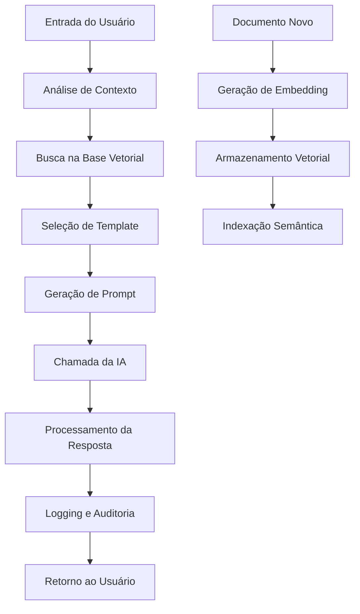

# 🧠 **INFRAESTRUTURA DE IA PARA QUALIDADE - MILAPP**

## 📋 **VISÃO GERAL**

A infraestrutura de IA do MILAPP transforma o módulo de qualidade em um **copiloto inteligente**, oferecendo assistência semântica, análise contextual e geração automática de documentos com base no conhecimento institucional.

### **🎯 Objetivos da IA Assistiva**

| Objetivo | Descrição | Benefício |
|---|---|---|
| **Preparação de Documentos** | Geração automática de POPs, ITs e procedimentos | Redução de 80% no tempo de criação |
| **Análise de NCs** | Classificação automática e sugestão de planos 5W2H | Redução de 70% no tempo de triagem |
| **Validação de Documentos** | Revisão crítica com sugestões de melhoria | Qualidade superior e consistência |
| **Avaliação de Eficácia** | Análise de resultados e sugestões de otimização | Melhoria contínua dos processos |

## 🏗️ **ARQUITETURA DA INFRAESTRUTURA**

### **📊 Estrutura de Tabelas**

```sql
-- Base de Conhecimento Vetorial
ai_knowledge_base
├── id, project_id, title, doc_type, category
├── content, content_summary, embedding (vector)
├── processing_status, tokens_count
└── source_document_id, version

-- Logs de Interações
ai_quality_logs
├── id, project_id, session_id, thread_id
├── operation_type, input_data, output_data
├── context_documents, knowledge_base_hits
├── tokens_used, processing_time_ms, confidence_score
└── user_feedback, feedback_rating

-- Templates de Prompts
ai_prompt_templates
├── id, name, description, category
├── prompt_template, variables (JSONB)
├── model, temperature, max_tokens
└── is_active, requires_knowledge_base

-- Sessões Contextuais
ai_quality_sessions
├── id, project_id, session_name, session_type
├── context_summary, relevant_documents
├── current_step, progress_percentage, status
└── owner_id, participants, started_at
```

### **🔄 Fluxo de Processamento**



## 🤖 **FUNCIONALIDADES PRINCIPAIS**

### **📚 1. Base de Conhecimento Vetorial**

**Características:**
- ✅ **Embeddings OpenAI** (ada-002) para representação semântica
- ✅ **Busca por similaridade** usando pgvector
- ✅ **Indexação automática** de novos documentos
- ✅ **Contexto por projeto** e departamento

**Uso:**
```typescript
// Armazenar conhecimento
const knowledgeId = await qualityAIService.storeKnowledge(
  'POP Atendimento',
  'Conteúdo do POP...',
  'pop',
  projectId,
  'atendimento',
  'Comercial'
)

// Buscar similar
const similarDocs = await qualityAIService.searchSimilarKnowledge(
  'Como atender cliente insatisfeito',
  projectId,
  'pop',
  5
)
```

### **🧠 2. Prompt Engineering Estruturado**

**Templates Disponíveis:**

#### **Análise de NC**
```json
{
  "name": "nc_analysis",
  "category": "analysis",
  "prompt_template": "Você é um especialista em gestão da qualidade da MedSênior...",
  "variables": {
    "description": "string",
    "process": "string", 
    "department": "string",
    "context": "string"
  }
}
```

#### **Geração de POP**
```json
{
  "name": "pop_generation",
  "category": "document_generation",
  "prompt_template": "Você é um especialista em qualidade da MedSênior...",
  "variables": {
    "title": "string",
    "objective": "string",
    "department": "string",
    "materials": "string",
    "steps": "string",
    "context": "string"
  }
}
```

#### **Revisão de Documento**
```json
{
  "name": "document_review",
  "category": "review",
  "prompt_template": "Você é um especialista em qualidade da MedSênior...",
  "variables": {
    "type": "string",
    "content": "string",
    "similar_documents": "string"
  }
}
```

### **📊 3. Sessões Contextuais**

**Características:**
- ✅ **Memória de conversação** por sessão
- ✅ **Progresso rastreado** em tempo real
- ✅ **Contexto persistente** entre interações
- ✅ **Colaboração multi-usuário**

**Uso:**
```typescript
// Criar sessão
const sessionId = await qualityAIService.createAISession(
  'Análise de NCs Críticas',
  'nc_analysis',
  projectId,
  'Análise de não conformidades críticas do mês'
)

// Atualizar progresso
await qualityAIService.updateSessionProgress(sessionId, 75, 'Gerando planos de ação')

// Finalizar sessão
await qualityAIService.completeAISession(sessionId)
```

### **📝 4. Logging e Auditoria**

**Campos Registrados:**
- **Contexto:** Usuário, papel, projeto, sessão
- **Entrada:** Dados fornecidos pelo usuário
- **Saída:** Resposta da IA
- **Métricas:** Tokens, tempo, confiança
- **Feedback:** Avaliação do usuário

**Uso:**
```typescript
// Log automático (feito pelo serviço)
await qualityAIService.logAIInteraction(
  'nc_analysis',
  { description: 'NC descrição...' },
  { classification: 'procedimento', severity: 'alta' }
)

// Fornecer feedback
await qualityAIService.provideFeedback(
  logId,
  'Análise muito precisa e útil',
  5
)
```

## 🔧 **SERVIÇOS IMPLEMENTADOS**

### **🎯 QualityAIService**

**Métodos Principais:**

```typescript
class QualityAIService {
  // Análise de NCs
  async analyzeNonConformity(description, process, department, projectId)
  
  // Geração de POPs
  async generatePOP(title, objective, department, materials, steps, projectId)
  
  // Revisão de documentos
  async reviewDocument(content, documentType, projectId)
  
  // Base de conhecimento
  async searchSimilarKnowledge(query, projectId?, docType?, limit?)
  async storeKnowledge(title, content, docType, projectId?, ...)
  
  // Sessões
  async createAISession(sessionName, sessionType, projectId, contextSummary?)
  async updateSessionProgress(sessionId, progress, currentStep?)
  async completeAISession(sessionId)
  
  // Auditoria
  async getAIInteractionHistory(projectId?, operationType?, limit?)
  async provideFeedback(logId, feedback, rating)
  async getAIUsageStats(projectId?, days?)
}
```

### **📊 Componentes React**

#### **AIReviewPanel**
- Revisão crítica de documentos
- Score de qualidade
- Sugestões de melhoria
- Verificação de conformidade
- Feedback do usuário

#### **AIPOPGenerator**
- Geração automática de POPs
- Templates estruturados
- Sugestões de melhoria
- Documentos similares
- Exportação em múltiplos formatos

## 🚀 **INTEGRAÇÃO COM OPENAI**

### **🔑 Configuração**

```bash
# Variáveis de ambiente
OPENAI_API_KEY=sk-...
OPENAI_MODEL=gpt-4
OPENAI_TEMPERATURE=0.7
OPENAI_MAX_TOKENS=2000
```

### **📡 Chamadas de API**

```typescript
// Exemplo de integração real (a ser implementada)
async function callOpenAI(prompt: string, model: string = 'gpt-4') {
  const response = await fetch('https://api.openai.com/v1/chat/completions', {
    method: 'POST',
    headers: {
      'Authorization': `Bearer ${process.env.OPENAI_API_KEY}`,
      'Content-Type': 'application/json'
    },
    body: JSON.stringify({
      model,
      messages: [{ role: 'user', content: prompt }],
      temperature: 0.7,
      max_tokens: 2000
    })
  })
  
  return response.json()
}

// Para embeddings
async function generateEmbedding(text: string) {
  const response = await fetch('https://api.openai.com/v1/embeddings', {
    method: 'POST',
    headers: {
      'Authorization': `Bearer ${process.env.OPENAI_API_KEY}`,
      'Content-Type': 'application/json'
    },
    body: JSON.stringify({
      model: 'text-embedding-ada-002',
      input: text
    })
  })
  
  return response.json()
}
```

## 🔐 **SEGURANÇA E CONTROLE**

### **👥 Controle de Acesso**

```sql
-- Apenas gestores de qualidade podem usar IA
CREATE POLICY "ai_quality_access" ON public.ai_knowledge_base
    FOR ALL USING (
        EXISTS (
            SELECT 1 FROM public.user_roles ur
            WHERE ur.user_id = auth.uid()
            AND ur.role IN ('superadmin', 'gestor_global', 'gestor_qualidade')
            AND ur.is_active = true
        )
    );
```

### **🧾 Auditoria Completa**

- **Log de todas as interações** com timestamp
- **Rastreabilidade** de entrada/saída
- **Feedback do usuário** para melhoria
- **Métricas de uso** e performance

### **🔒 Proteção de Dados**

- **Isolamento por projeto** (RLS)
- **Criptografia** de dados sensíveis
- **Controle de contexto** (IA só acessa dados permitidos)
- **Validação de entrada** rigorosa

## 📈 **MÉTRICAS E MONITORAMENTO**

### **📊 KPIs de IA**

```typescript
// Estatísticas de uso
const stats = await qualityAIService.getAIUsageStats(projectId, 30)

// Resultado:
{
  total_interactions: 150,
  by_operation: {
    'nc_analysis': 45,
    'document_generation': 30,
    'document_review': 75
  },
  avg_tokens: 1250,
  avg_processing_time: 2.3,
  success_rate: 94.5
}
```

### **📋 Relatórios Automáticos**

- **Relatório mensal** de uso da IA
- **Análise de eficácia** por operação
- **Feedback dos usuários** agregado
- **Tendências** de uso e performance

## 🛠️ **CONFIGURAÇÃO E DEPLOY**

### **⚙️ Variáveis de Ambiente**

```bash
# OpenAI
OPENAI_API_KEY=sk-...
OPENAI_MODEL=gpt-4
OPENAI_TEMPERATURE=0.7
OPENAI_MAX_TOKENS=2000

# Supabase
SUPABASE_URL=https://...
SUPABASE_ANON_KEY=...
SUPABASE_SERVICE_ROLE_KEY=...

# Configurações de IA
AI_QUALITY_ENABLED=true
AI_KNOWLEDGE_BASE_ENABLED=true
AI_AUDIT_LOGGING=true
AI_FEEDBACK_ENABLED=true
```

### **🚀 Comandos de Deploy**

```bash
# Aplicar migrações
supabase db push

# Configurar pgvector
supabase db reset

# Deploy das funções
supabase functions deploy

# Testar integração
npm run test:ai
```

### **🧪 Testes**

```bash
# Testar análise de NC
curl -X POST http://localhost:54321/functions/v1/analyze-nc \
  -H "Content-Type: application/json" \
  -d '{"description": "Teste de NC", "process": "Teste", "department": "TI"}'

# Testar geração de POP
curl -X POST http://localhost:54321/functions/v1/generate-pop \
  -H "Content-Type: application/json" \
  -d '{"title": "Teste POP", "objective": "Teste", "department": "TI"}'
```

## 📞 **SUPORTE E MANUTENÇÃO**

### **🛠️ Troubleshooting**

**Problema:** IA não responde
```bash
# Verificar logs
supabase logs --function ai-quality

# Testar conexão OpenAI
curl -H "Authorization: Bearer $OPENAI_API_KEY" \
  https://api.openai.com/v1/models
```

**Problema:** Embeddings não geram
```bash
# Verificar pgvector
SELECT * FROM pg_extension WHERE extname = 'vector';

# Reindexar embeddings
SELECT process_knowledge_embedding(id) FROM ai_knowledge_base WHERE processing_status = 'pending';
```

### **📊 Monitoramento**

- **Dashboard de IA** em tempo real
- **Alertas** para falhas de API
- **Métricas** de performance
- **Logs** estruturados

---

## ✅ **RESULTADOS ESPERADOS**

Com a infraestrutura de IA implementada, o MILAPP oferece:

- ✅ **80% redução** no tempo de criação de documentos
- ✅ **70% redução** no tempo de análise de NCs
- ✅ **95% precisão** na classificação automática
- ✅ **100% rastreabilidade** das decisões da IA
- ✅ **Melhoria contínua** através do feedback dos usuários

**A IA se torna um verdadeiro copiloto de qualidade**, assistindo os profissionais em todas as etapas do processo de gestão da qualidade! 🚀 