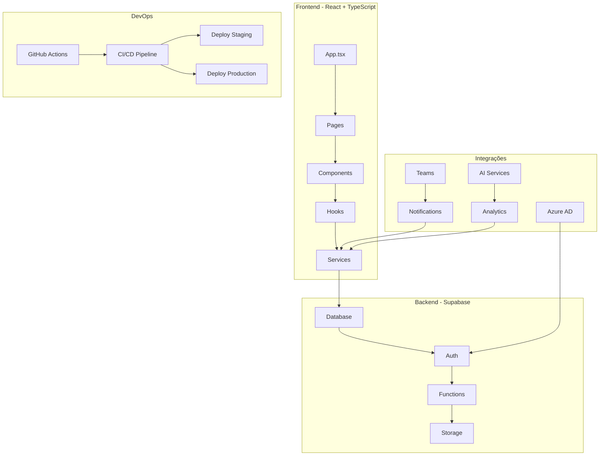
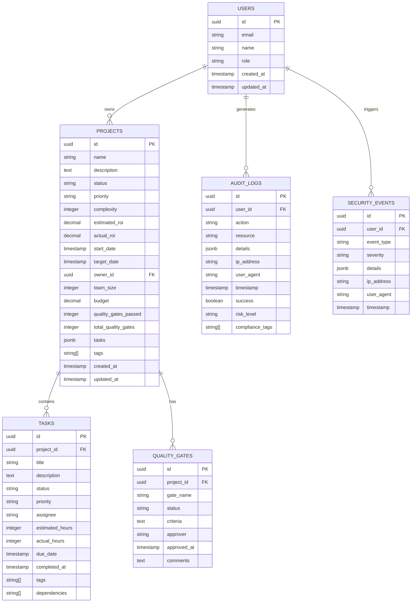
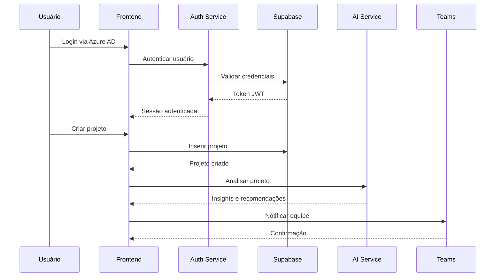
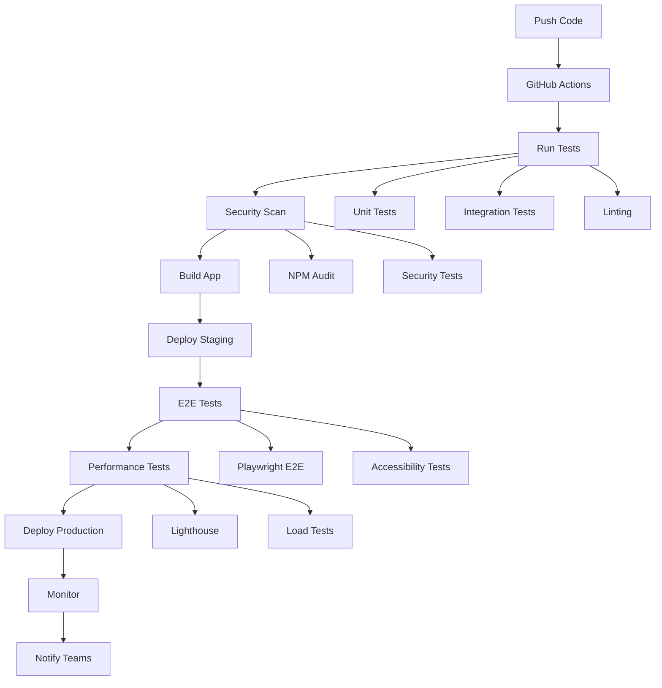
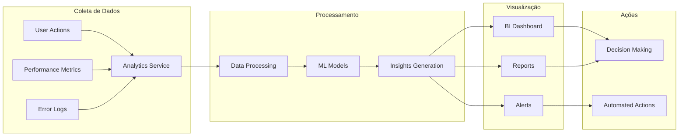
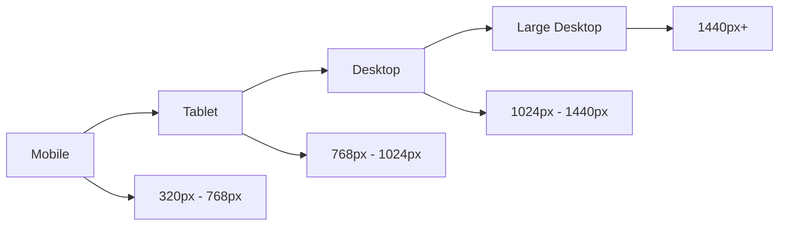

# 🏗️ Arquitetura MILAPP MedSênior

## 📋 Visão Geral

O MILAPP MedSênior é uma aplicação enterprise-grade para gestão de projetos de automação, construída com tecnologias modernas e seguindo padrões de qualidade corporativa.

## 🎯 Objetivos da Arquitetura

- **Escalabilidade**: Suporte a múltiplos ambientes e crescimento
- **Segurança**: Compliance LGPD/GDPR, criptografia, auditoria
- **Performance**: Carregamento < 3s, otimização de recursos
- **Manutenibilidade**: Código limpo, testes automatizados, documentação
- **UX Premium**: Interface intuitiva para usuários 49+

## 🏛️ Arquitetura Geral



## 🗂️ Estrutura de Pastas

```
milapp-supabase-builder/
├── src/
│   ├── components/          # Componentes React reutilizáveis
│   │   ├── Projects/        # Componentes específicos de projetos
│   │   ├── Layout/          # Componentes de layout
│   │   └── ui/              # Componentes base (shadcn/ui)
│   ├── pages/               # Páginas da aplicação
│   ├── hooks/               # Custom hooks React
│   ├── services/            # Serviços de integração
│   │   ├── analytics/       # Serviços de analytics
│   │   ├── auth/            # Autenticação e autorização
│   │   ├── security/        # Segurança e criptografia
│   │   └── audit/           # Auditoria e compliance
│   ├── contexts/            # Contextos React
│   ├── types/               # Definições TypeScript
│   └── tests/               # Testes automatizados
├── supabase/                # Configuração Supabase
│   ├── migrations/          # Migrações do banco
│   ├── functions/           # Edge functions
│   └── seeds/               # Dados iniciais
├── docs/                    # Documentação técnica
└── .github/                 # GitHub Actions
```

## 🔐 Arquitetura de Segurança

```mermaid
graph LR
    subgraph "Camada de Autenticação"
        A[Azure AD] --> B[MSAL.js]
        B --> C[Supabase Auth]
    end
    
    subgraph "Camada de Autorização"
        D[RBAC Service] --> E[Permission Check]
        E --> F[Resource Access]
    end
    
    subgraph "Camada de Proteção"
        G[Rate Limiting] --> H[Input Sanitization]
        H --> I[Encryption Service]
    end
    
    subgraph "Camada de Auditoria"
        J[Audit Service] --> K[Security Events]
        K --> L[Compliance Check]
    end
    
    C --> D
    F --> G
    I --> J
```



### **Princípios de Segurança**

1. **Defesa em Profundidade**: Múltiplas camadas de proteção
2. **Princípio do Menor Privilégio**: Acesso mínimo necessário
3. **Auditoria Completa**: Log de todas as ações
4. **Criptografia End-to-End**: Dados sensíveis sempre criptografados
5. **Compliance Automático**: LGPD/GDPR/SOX integrados

## 🗄️ Modelo de Dados



## 🔄 Fluxo de Dados



## 🚀 Pipeline CI/CD



## 📊 Monitoramento e Analytics



## 🔧 Tecnologias Utilizadas

### **Frontend**
- **React 18**: Framework principal
- **TypeScript**: Tipagem estática
- **Material-UI v5**: Componentes de UI
- **Framer Motion**: Animações
- **React Query**: Gerenciamento de estado
- **React Hook Form**: Formulários

### **Backend**
- **Supabase**: Backend-as-a-Service
- **PostgreSQL**: Banco de dados
- **Edge Functions**: Serverless functions
- **Real-time**: Subscriptions em tempo real

### **Autenticação**
- **Azure AD**: Single Sign-On
- **MSAL.js**: Cliente de autenticação
- **RBAC**: Controle de acesso baseado em roles

### **DevOps**
- **GitHub Actions**: CI/CD
- **Vercel**: Deploy frontend
- **Supabase CLI**: Deploy backend
- **Playwright**: Testes E2E

### **Monitoramento**
- **Analytics**: Métricas de uso
- **Error Tracking**: Captura de erros
- **Performance**: Métricas de performance

## 🎨 Design System

### **Cores MedSênior**
```css
:root {
  --medsenior-primary: #327746;
  --medsenior-secondary: #95c11f;
  --medsenior-accent: #28a745;
  --medsenior-neutral: #6c757d;
  --medsenior-success: #198754;
  --medsenior-warning: #ffc107;
  --medsenior-error: #dc3545;
  --medsenior-info: #0dcaf0;
}
```

### **Tipografia**
- **Fonte Principal**: Inter
- **Tamanhos**: 12px, 14px, 16px, 18px, 24px, 32px, 48px
- **Pesos**: 400 (Regular), 500 (Medium), 600 (SemiBold), 700 (Bold)

### **Espaçamento**
- **Base**: 8px
- **Escala**: 8px, 16px, 24px, 32px, 48px, 64px

## 📱 Responsividade



## 🔒 Compliance e Regulamentações

### **LGPD (Lei Geral de Proteção de Dados)**
- ✅ Consentimento explícito
- ✅ Direito ao esquecimento
- ✅ Portabilidade de dados
- ✅ Notificação de violações
- ✅ DPO designado

### **GDPR (General Data Protection Regulation)**
- ✅ Princípios de proteção
- ✅ Direitos dos titulares
- ✅ Transferências internacionais
- ✅ Sanções administrativas

### **SOX (Sarbanes-Oxley Act)**
- ✅ Controles internos
- ✅ Auditoria independente
- ✅ Certificação de relatórios
- ✅ Responsabilidade executiva

## 🚀 Roadmap de Evolução

### **Fase 1 - MVP (Concluído)**
- ✅ Autenticação Azure AD
- ✅ CRUD de projetos
- ✅ Quality Gates básico
- ✅ Interface responsiva

### **Fase 2 - Enterprise (Atual)**
- ✅ Segurança avançada
- ✅ Analytics e BI
- ✅ Testes automatizados
- ✅ CI/CD pipeline

### **Fase 3 - Inteligência (Próximo)**
- 🔄 IA avançada para predições
- 🔄 Machine Learning para otimização
- 🔄 Automação inteligente
- 🔄 Insights preditivos

### **Fase 4 - Escala (Futuro)**
- 📋 Multi-tenant
- 📋 Microservices
- 📋 Kubernetes
- 📋 Edge computing

## 📞 Suporte e Contato

Para dúvidas técnicas ou suporte:

- **Email**: tech-support@medsenior.com.br
- **Teams**: Canal #milapp-support
- **Documentação**: [docs.medsenior.com.br/milapp](https://docs.medsenior.com.br/milapp)
- **Repositório**: [github.com/medsenior/milapp-supabase-builder](https://github.com/medsenior/milapp-supabase-builder)

---

**Versão**: 2.0.0  
**Última atualização**: 19/07/2024  
**Autor**: Equipe de Desenvolvimento MedSênior 