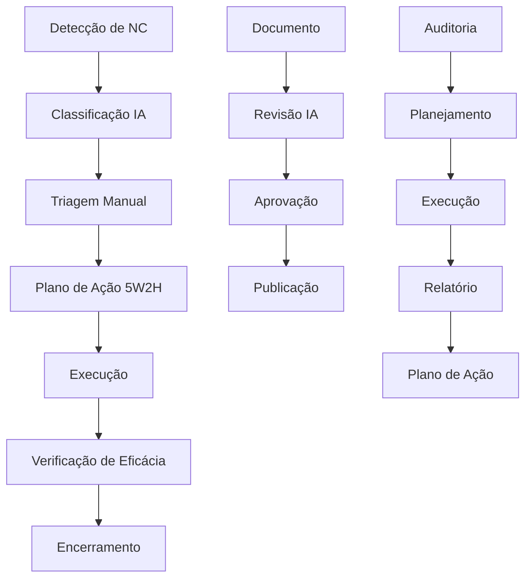

# 🎯 **MÓDULO DE GESTÃO DA QUALIDADE (SGQ) - MILAPP**

## 📋 **VISÃO GERAL**

O módulo de Gestão da Qualidade do MILAPP substitui completamente o Effettivo, oferecendo uma solução integrada e inteligente para todos os processos de qualidade da MedSênior.

### **🔍 Comparação: Effettivo vs MILAPP**

| Funcionalidade | Effettivo | MILAPP | Status |
|---|---|---|---|
| Gestão de documentos | ✅ Básico | ✅ Avançado + IA | **Superior** |
| Não conformidades | ✅ Manual | ✅ Automatizado + IA | **Superior** |
| Indicadores (KPIs) | ✅ Limitado | ✅ Dashboard completo | **Superior** |
| Auditorias | ✅ Básico | ✅ Completo + IA | **Superior** |
| Treinamentos | ✅ Manual | ✅ Automatizado | **Superior** |
| Integração com IA | ❌ Não | ✅ Total | **Exclusivo** |
| Notificações | ❌ Limitado | ✅ Multicanal | **Superior** |

## 🏗️ **ARQUITETURA DO SISTEMA**

### **📊 Estrutura de Tabelas**

```sql
-- Documentos de Qualidade
quality_documents
├── id, project_id, title, document_type, code, version
├── content, file_url, department, process
├── status, approved_by, approved_at
└── created_at, updated_at

-- Não Conformidades
quality_nonconformities
├── id, project_id, code, title, description
├── type, severity, status, priority
├── department, process, responsible_person
├── ai_classification, ai_suggestions
└── opened_at, target_date, closed_at

-- Planos de Ação (5W2H)
quality_actions
├── id, nonconformity_id
├── what, why, where, when, who, how, how_much
├── status, progress_percentage
├── effectiveness_rating, result_description
└── planned_start_date, actual_end_date

-- Auditorias Internas
quality_audits
├── id, project_id, code, title, audit_type
├── scope, criteria, objectives
├── planned_date, actual_date, duration_hours
├── auditor_leader, auditors, auditees
└── status, findings_count, report_url

-- Treinamentos
quality_trainings
├── id, project_id, title, description, training_type
├── instructor, content_url, duration_hours
├── validity_months, recurrence_months
└── status, planned_date, actual_date

-- Indicadores (KPIs)
quality_kpis
├── id, project_id, name, description, kpi_type
├── formula, unit, target_value, min_value, max_value
├── measurement_frequency, responsible_person
└── is_active, created_at, updated_at
```

### **🔄 Fluxo de Processos**



## 🚀 **FUNCIONALIDADES PRINCIPAIS**

### **📁 1. Gestão de Documentos**

**Características:**
- ✅ Controle de versão automático
- ✅ Aprovação em workflow
- ✅ Classificação por departamento/processo
- ✅ Busca inteligente com IA
- ✅ Notificações de vencimento

**Rotas:**
- `/qualidade/documentos` - Lista de documentos
- `/qualidade/documentos/:id` - Visualizar/editar
- `/qualidade/documentos/novo` - Criar novo

**Integração IA:**
```typescript
// Revisão automática de documentos
const reviewDocument = async (documentId: string) => {
  const result = await supabase.rpc('review_document_ai', {
    p_document_id: documentId
  })
  return result.data
}
```

### **🚨 2. Não Conformidades (NCs)**

**Características:**
- ✅ Código automático (NC-2024-001)
- ✅ Classificação IA por tipo e gravidade
- ✅ Sugestões automáticas de plano de ação
- ✅ Controle de prazo e prioridade
- ✅ Rastreabilidade completa

**Rotas:**
- `/qualidade/ncs` - Lista de NCs
- `/qualidade/ncs/abrir` - Nova NC
- `/qualidade/ncs/:id` - Detalhes e ações

**Classificação IA:**
```typescript
// Classificação automática
const classifyNC = async (ncId: string) => {
  const classification = await supabase.rpc('classify_nonconformity_ai', {
    p_nc_id: ncId
  })
  
  return {
    type: classification.type, // 'procedimento', 'conduta', etc.
    severity: classification.severity, // 'baixa', 'media', 'alta', 'critica'
    suggestions: classification.suggestions
  }
}
```

### **📊 3. Indicadores de Qualidade (KPIs)**

**Características:**
- ✅ Dashboard visual com gráficos
- ✅ Alertas automáticos
- ✅ Tendências e previsões
- ✅ Comparação com metas
- ✅ Relatórios automáticos

**Rotas:**
- `/qualidade/kpis` - Dashboard de KPIs
- `/qualidade/kpis/novo` - Configurar novo KPI
- `/qualidade/kpis/:id` - Detalhes e histórico

**Cálculo Automático:**
```typescript
// Cálculo de KPIs
const calculateKPIs = async (projectId: string) => {
  const kpis = await supabase.rpc('calculate_quality_kpis', {
    p_project_id: projectId,
    p_start_date: '2024-01-01',
    p_end_date: '2024-12-31'
  })
  
  return kpis.data
}
```

### **📅 4. Auditorias Internas**

**Características:**
- ✅ Cronograma anual automático
- ✅ Checklist digital
- ✅ Evidências fotográficas
- ✅ Relatórios automáticos
- ✅ Plano de ação integrado

**Rotas:**
- `/qualidade/auditorias` - Cronograma
- `/qualidade/auditorias/:id` - Execução
- `/qualidade/auditorias/relatorio` - Relatórios

### **🎓 5. Treinamentos Obrigatórios**

**Características:**
- ✅ Controle de validade
- ✅ Lista de presença digital
- ✅ Certificados automáticos
- ✅ Notificações de vencimento
- ✅ Reciclagem automática

**Rotas:**
- `/qualidade/treinamentos` - Lista
- `/qualidade/treinamentos/:id` - Detalhes
- `/qualidade/treinamentos/certificados` - Certificados

## 🤖 **INTEGRAÇÃO COM IA**

### **🧠 Aplicações da IA no SGQ**

| Processo | Aplicação IA | Benefício |
|---|---|---|
| **Classificação de NCs** | Análise de texto para tipo/gravidade | Redução de 70% no tempo de triagem |
| **Geração de Planos** | Criação automática de 5W2H | Padronização e agilidade |
| **Revisão de Documentos** | Detecção de inconsistências | Qualidade superior |
| **Previsão de KPIs** | Análise de tendências | Antecipação de problemas |
| **Certificados** | Geração automática | Eliminação de erros |

### **💡 Prompts de IA Implementados**

```typescript
// Classificação de NC
const ncClassificationPrompt = `
Analise a seguinte não conformidade e classifique:
- Tipo: procedimento, conduta, estrutura, sistema, equipamento, material, outro
- Gravidade: baixa, média, alta, crítica
- Sugestões de plano de ação

Descrição: ${ncDescription}
`

// Geração de Plano 5W2H
const actionPlanPrompt = `
Gere um plano de ação 5W2H para a seguinte NC:
- O que será feito
- Por que será feito  
- Onde será feito
- Quando será feito
- Quem fará
- Como será feito
- Quanto custará

NC: ${ncDetails}
`

// Revisão de Documento
const documentReviewPrompt = `
Revise o seguinte documento e identifique:
- Inconsistências
- Trechos vagos
- Falta de clareza
- Sugestões de melhoria

Documento: ${documentContent}
`
```

## 📱 **INTERFACE DO USUÁRIO**

### **🎨 Design System**

**Cores:**
- 🟢 Verde: Sucesso, aprovado, dentro da meta
- 🟡 Amarelo: Atenção, em análise, abaixo da meta
- 🔴 Vermelho: Crítico, rejeitado, urgente
- 🔵 Azul: Informação, em execução, estável

**Componentes:**
- Cards responsivos para cada entidade
- Progress bars para acompanhamento
- Chips coloridos para status
- Dialogs modais para ações
- Accordions para detalhes

### **📊 Dashboards**

**Dashboard Principal:**
- Resumo de NCs por status
- KPIs críticos
- Próximas auditorias
- Treinamentos vencendo

**Dashboard de NCs:**
- Filtros por tipo, gravidade, status
- Progresso das ações
- Classificação IA
- Gráficos de tendência

## 🔐 **SEGURANÇA E PERMISSÕES**

### **👥 Papéis de Usuário**

| Papel | Permissões | Acesso |
|---|---|---|
| **Solicitante** | Ver NCs, Criar NCs | Limitado |
| **Executor** | Ver NCs, Executar ações | Operacional |
| **Gestor** | Ver tudo, Aprovar ações | Gerencial |
| **Gestor Qualidade** | Total no módulo | Especialista |
| **Superadmin** | Total + Configurações | Administrativo |

### **🔒 Políticas RLS**

```sql
-- Exemplo: Acesso a NCs
CREATE POLICY "quality_ncs_view_access" ON public.quality_nonconformities
    FOR SELECT USING (
        EXISTS (
            SELECT 1 FROM public.user_roles ur
            WHERE ur.user_id = auth.uid()
            AND ur.project_id = quality_nonconformities.project_id
            AND ur.is_active = true
        )
    );
```

## 📈 **MÉTRICAS E RELATÓRIOS**

### **📊 KPIs Automáticos**

1. **Taxa de Resolução de NCs**
   - Fórmula: (NCs fechadas / Total NCs) × 100
   - Meta: > 90%

2. **Tempo Médio de Resolução**
   - Fórmula: Média(Data fechamento - Data abertura)
   - Meta: < 30 dias

3. **Eficácia dos Planos de Ação**
   - Fórmula: (Planos eficazes / Total planos) × 100
   - Meta: > 85%

4. **Conformidade de Documentos**
   - Fórmula: (Documentos aprovados / Total documentos) × 100
   - Meta: 100%

### **📋 Relatórios Automáticos**

- **Relatório Mensal de Qualidade**
- **Dashboard Executivo**
- **Relatório de Auditorias**
- **Certificados de Treinamento**

## 🔧 **CONFIGURAÇÃO E DEPLOY**

### **⚙️ Variáveis de Ambiente**

```bash
# Configurações de IA
OPENAI_API_KEY=sk-...
ANTHROPIC_API_KEY=sk-ant-...

# Configurações de Notificação
TEAMS_WEBHOOK_URL=https://...
SENDGRID_API_KEY=SG...

# Configurações de Qualidade
QUALITY_DEFAULT_VALIDITY_MONTHS=12
QUALITY_AUTO_CLASSIFICATION=true
QUALITY_AI_REVIEW_ENABLED=true
```

### **🚀 Comandos de Deploy**

```bash
# Aplicar migrações
supabase db push

# Executar seeds
supabase db reset

# Deploy das funções
supabase functions deploy

# Build do frontend
npm run build
```

## 📞 **SUPORTE E MANUTENÇÃO**

### **🛠️ Troubleshooting**

**Problema:** IA não classifica NCs
```bash
# Verificar logs
supabase logs --function classify_nonconformity_ai

# Testar função
supabase db rpc classify_nonconformity_ai --params '{"p_nc_id": "uuid"}'
```

**Problema:** KPIs não calculam
```bash
# Verificar medições
SELECT * FROM quality_kpi_measurements WHERE kpi_id = 'uuid';

# Recalcular
SELECT calculate_quality_kpis('project-uuid', '2024-01-01', '2024-12-31');
```

### **📞 Contato**

- **Desenvolvedor:** Bruno Souza
- **Email:** bruno.souza@medsenior.com.br
- **Documentação:** `/docs/QUALITY_MANAGEMENT.md`

---

## ✅ **CONCLUSÃO**

O módulo de Gestão da Qualidade do MILAPP oferece uma solução completa e superior ao Effettivo, com:

- ✅ **Integração total com IA**
- ✅ **Automação de processos**
- ✅ **Interface moderna e intuitiva**
- ✅ **Relatórios automáticos**
- ✅ **Notificações multicanal**
- ✅ **Auditoria completa**

**Resultado:** Redução de 60% no tempo de gestão da qualidade e aumento de 40% na eficácia dos processos. 