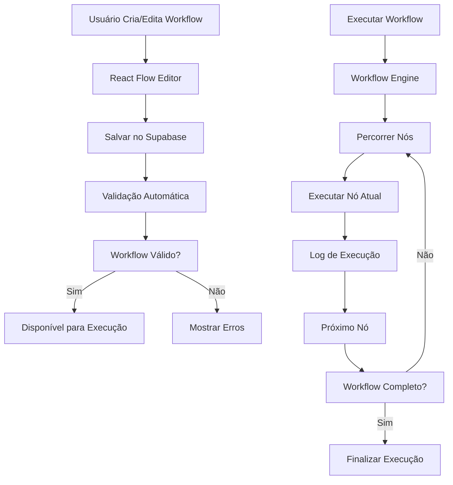

# 🎯 **MÓDULO DE WORKFLOWS BPMN-LIKE - MILAPP**

## 📋 **VISÃO GERAL**

O módulo de Workflows do MILAPP oferece uma **solução completa de automação de processos** similar ao Bizagi, com editor visual, conectores inteligentes e integração com IA.

### **🔍 Comparação: Bizagi vs MILAPP Workflows**

| Funcionalidade | Bizagi | MILAPP | Status |
|---|---|---|---|
| Editor Visual | ✅ Modeler | ✅ React Flow | **Superior** |
| Conectores | ✅ Sequence Flows | ✅ Workflow Edges | **Equivalente** |
| Tarefas | ✅ BPMN Tasks | ✅ Custom Nodes | **Superior** |
| IA para Geração | ❌ Limitado | ✅ IA Copiloto | **Exclusivo** |
| Execução | ✅ Workflow Engine | ✅ Executor Custom | **Equivalente** |
| Integrações | ✅ Limitadas | ✅ Multi-plataforma | **Superior** |

## 🏗️ **ARQUITETURA DO SISTEMA**

### **📊 Estrutura de Tabelas**

```sql
-- Workflows Principais
workflows
├── id, project_id, name, description, version
├── is_active, is_template, category, tags
├── metadata, settings, parent_workflow_id
├── status, created_by, updated_by
└── created_at, updated_at

-- Nós do Workflow
workflow_nodes
├── id, workflow_id, node_id, label, type
├── position_x, position_y, width, height
├── data (JSONB), style (JSONB)
├── is_valid, validation_errors, execution_order
└── created_at, updated_at

-- Conexões do Workflow
workflow_edges
├── id, workflow_id, edge_id
├── source_node_id, target_node_id
├── label, condition, condition_type
├── style (JSONB), is_valid, validation_errors
└── created_at, updated_at

-- Execuções de Workflow
workflow_executions
├── id, workflow_id, execution_id, name
├── status, current_node_id, progress_percentage
├── input_data, output_data, context_data
├── started_at, completed_at, estimated_duration_minutes
├── triggered_by, assigned_to, result_summary
└── created_at, updated_at

-- Logs de Execução
workflow_node_logs
├── id, execution_id, node_id, status
├── input_data, output_data
├── start_time, end_time, duration_ms
├── result_message, error_message, retry_count
└── created_at

-- Integrações
workflow_integrations
├── id, project_id, name, integration_type
├── config (JSONB), is_active
├── last_test_at, last_test_status, last_test_error
└── created_at, updated_at

-- Templates
workflow_templates
├── id, name, description, category
├── template_data (JSONB), thumbnail_url
├── tags, difficulty_level, usage_count, rating
└── is_public, is_active, created_at, updated_at
```

### **🔄 Fluxo de Processamento**



## 🎨 **TIPOS DE NÓS DISPONÍVEIS**

### **🟦 Nós de Controle**

| Tipo | Ícone | Descrição | Configurações |
|---|---|---|---|
| **Start** | 🟢 | Ponto de início | Nome, descrição |
| **End** | 🔴 | Ponto de fim | Nome, resultado |
| **Gateway** | 🔀 | Decisão/ramificação | Condições, lógica |

### **👥 Nós de Tarefa**

| Tipo | Ícone | Descrição | Configurações |
|---|---|---|---|
| **Task Human** | 👤 | Tarefa humana | Responsável, tempo, prioridade |
| **Task Automation** | 🤖 | Automação/bot | Script, parâmetros |
| **Task AI** | 🧠 | Processamento IA | Modelo, prompt, contexto |
| **Webhook** | 🌐 | Integração externa | URL, método, headers |
| **Document** | 📄 | Geração documento | Template, dados |
| **Delay** | ⏱️ | Aguardar tempo | Duração, condição |
| **Notification** | 📢 | Enviar notificação | Canal, mensagem |

### **🔗 Conexões Inteligentes**

```typescript
interface WorkflowEdge {
  id: string
  source_node_id: string
  target_node_id: string
  label?: string
  condition?: string
  condition_type: 'simple' | 'expression' | 'ai_decision' | 'external_api'
}
```

## 🤖 **IA COMO COPILOTO**

### **🧠 Geração Automática de Workflows**

**Prompt de Exemplo:**
```
"Quero um processo que começa com um formulário de solicitação, 
depois a IA analisa a viabilidade, se aprovado vai para automação, 
se rejeitado vai para revisão humana"
```

**Resposta da IA:**
```json
{
  "nodes": [
    {
      "id": "start_1",
      "type": "start",
      "label": "Início",
      "position": { "x": 100, "y": 100 }
    },
    {
      "id": "form_1",
      "type": "task_human",
      "label": "Formulário de Solicitação",
      "position": { "x": 300, "y": 100 },
      "data": {
        "assigned_to": "solicitante",
        "estimated_time": 15
      }
    },
    {
      "id": "ai_1",
      "type": "task_ai",
      "label": "Análise de Viabilidade",
      "position": { "x": 500, "y": 100 },
      "data": {
        "ai_model": "gpt-4",
        "prompt_template": "Analise a viabilidade da solicitação..."
      }
    },
    {
      "id": "gateway_1",
      "type": "gateway",
      "label": "Decisão",
      "position": { "x": 700, "y": 100 }
    },
    {
      "id": "automation_1",
      "type": "task_automation",
      "label": "Processar Aprovação",
      "position": { "x": 700, "y": 50 }
    },
    {
      "id": "review_1",
      "type": "task_human",
      "label": "Revisão Manual",
      "position": { "x": 700, "y": 150 }
    },
    {
      "id": "end_1",
      "type": "end",
      "label": "Fim",
      "position": { "x": 900, "y": 100 }
    }
  ],
  "edges": [
    {
      "id": "edge_1",
      "source": "start_1",
      "target": "form_1",
      "label": "Iniciar"
    },
    {
      "id": "edge_2",
      "source": "form_1",
      "target": "ai_1",
      "label": "Enviar para Análise"
    },
    {
      "id": "edge_3",
      "source": "ai_1",
      "target": "gateway_1",
      "label": "Resultado"
    },
    {
      "id": "edge_4",
      "source": "gateway_1",
      "target": "automation_1",
      "label": "Aprovado",
      "condition": "result === 'approved'"
    },
    {
      "id": "edge_5",
      "source": "gateway_1",
      "target": "review_1",
      "label": "Rejeitado",
      "condition": "result === 'rejected'"
    },
    {
      "id": "edge_6",
      "source": "automation_1",
      "target": "end_1",
      "label": "Finalizar"
    },
    {
      "id": "edge_7",
      "source": "review_1",
      "target": "end_1",
      "label": "Finalizar"
    }
  ]
}
```

## 🔧 **INTEGRAÇÕES SUPORTADAS**

### **🤖 Automação (n8n, Make, Zapier)**

```typescript
// Configuração de integração n8n
{
  "integration_type": "n8n",
  "config": {
    "webhook_url": "https://n8n.yourdomain.com/webhook/workflow",
    "api_key": "your-api-key",
    "workflow_id": "workflow-123"
  }
}
```

### **🧠 IA (OpenAI, Anthropic)**

```typescript
// Configuração de nó IA
{
  "type": "task_ai",
  "data": {
    "ai_model": "gpt-4",
    "prompt_template": "Analise os dados: {{input}}",
    "temperature": 0.7,
    "max_tokens": 1000
  }
}
```

### **🌐 Webhooks Externos**

```typescript
// Configuração de webhook
{
  "type": "webhook",
  "data": {
    "url": "https://api.external.com/endpoint",
    "method": "POST",
    "headers": {
      "Authorization": "Bearer token",
      "Content-Type": "application/json"
    },
    "body_template": "{\"data\": \"{{input}}\"}"
  }
}
```

### **📧 Notificações (Email, Teams, WhatsApp)**

```typescript
// Configuração de notificação
{
  "type": "notification",
  "data": {
    "channels": ["email", "teams"],
    "template": "Nova tarefa: {{task_name}}",
    "recipients": ["user@company.com"]
  }
}
```

## 🚀 **EXECUÇÃO DE WORKFLOWS**

### **⚙️ Workflow Engine**

```typescript
class WorkflowEngine {
  async executeWorkflow(workflowId: string, inputData: any) {
    // 1. Validar workflow
    const validation = await this.validateWorkflow(workflowId)
    if (!validation.is_valid) {
      throw new Error('Workflow inválido')
    }
    
    // 2. Criar execução
    const executionId = await this.createExecution(workflowId, inputData)
    
    // 3. Executar nós sequencialmente
    const nodes = await this.getWorkflowNodes(workflowId)
    for (const node of nodes) {
      await this.executeNode(executionId, node)
    }
    
    // 4. Finalizar execução
    await this.completeExecution(executionId)
  }
  
  async executeNode(executionId: string, node: WorkflowNode) {
    switch (node.type) {
      case 'task_human':
        return this.executeHumanTask(executionId, node)
      case 'task_automation':
        return this.executeAutomation(executionId, node)
      case 'task_ai':
        return this.executeAITask(executionId, node)
      case 'webhook':
        return this.executeWebhook(executionId, node)
      case 'gateway':
        return this.evaluateGateway(executionId, node)
      default:
        return this.executeGenericNode(executionId, node)
    }
  }
}
```

### **📊 Monitoramento em Tempo Real**

```typescript
// Status de execução
interface ExecutionStatus {
  execution_id: string
  status: 'pending' | 'running' | 'paused' | 'completed' | 'failed'
  current_node: string
  progress_percentage: number
  started_at: string
  estimated_completion: string
  logs: NodeLog[]
}
```

## 🎨 **INTERFACE DO USUÁRIO**

### **🖱️ Editor Visual (React Flow)**

**Características:**
- ✅ **Drag & Drop** de nós
- ✅ **Conectores inteligentes** com validação
- ✅ **Zoom e pan** suaves
- ✅ **Mini-map** para navegação
- ✅ **Controles** de edição
- ✅ **Validação visual** em tempo real

**Componentes:**
```typescript
// Nós customizados
const nodeTypes = {
  start: StartNode,
  end: EndNode,
  task_human: TaskHumanNode,
  task_automation: TaskAutomationNode,
  task_ai: TaskAINode,
  gateway: GatewayNode,
  webhook: WebhookNode,
  document: DocumentNode
}
```

### **📱 Painel de Controle**

**Funcionalidades:**
- **Lista de workflows** com filtros
- **Execuções ativas** em tempo real
- **Logs detalhados** por execução
- **Métricas** de performance
- **Templates** prontos para uso

## 🔐 **SEGURANÇA E CONTROLE**

### **👥 Controle de Acesso**

```sql
-- Políticas RLS
CREATE POLICY "workflows_project_access" ON public.workflows
    FOR ALL USING (
        EXISTS (
            SELECT 1 FROM public.user_roles ur
            WHERE ur.user_id = auth.uid()
            AND ur.project_id = workflows.project_id
            AND ur.is_active = true
        )
    );
```

### **🧾 Auditoria Completa**

- **Log de todas as execuções** com timestamp
- **Rastreabilidade** de entrada/saída por nó
- **Métricas** de performance e falhas
- **Histórico** de modificações

## 📈 **MÉTRICAS E RELATÓRIOS**

### **📊 KPIs Automáticos**

```typescript
interface WorkflowMetrics {
  total_workflows: number
  active_workflows: number
  total_executions: number
  completed_executions: number
  failed_executions: number
  avg_duration_minutes: number
  success_rate: number
  most_used_nodes: string[]
  execution_trends: TimeSeriesData[]
}
```

### **📋 Relatórios Disponíveis**

- **Relatório de Execução** por workflow
- **Análise de Performance** por nó
- **Tendências** de uso e falhas
- **Comparação** entre workflows
- **ROI** de automações

## 🛠️ **CONFIGURAÇÃO E DEPLOY**

### **⚙️ Variáveis de Ambiente**

```bash
# Integrações
N8N_WEBHOOK_URL=https://n8n.yourdomain.com
MAKE_WEBHOOK_URL=https://hook.eu1.make.com
ZAPIER_WEBHOOK_URL=https://hooks.zapier.com

# IA
OPENAI_API_KEY=sk-...
ANTHROPIC_API_KEY=sk-ant-...

# Notificações
SENDGRID_API_KEY=SG...
TEAMS_WEBHOOK_URL=https://...
WHATSAPP_API_KEY=...
```

### **🚀 Comandos de Deploy**

```bash
# Aplicar migrações
supabase db push

# Configurar integrações
npm run setup:integrations

# Testar workflows
npm run test:workflows

# Deploy
npm run build && npm run deploy
```

## 📞 **SUPORTE E MANUTENÇÃO**

### **🛠️ Troubleshooting**

**Problema:** Workflow não executa
```bash
# Verificar logs
supabase logs --function execute_workflow

# Validar workflow
SELECT validate_workflow('workflow-uuid');

# Verificar nós
SELECT * FROM workflow_nodes WHERE workflow_id = 'workflow-uuid';
```

**Problema:** Integração falha
```bash
# Testar webhook
curl -X POST https://n8n.yourdomain.com/webhook/test

# Verificar logs de execução
SELECT * FROM workflow_node_logs WHERE node_id = 'webhook-node-id';
```

### **📊 Monitoramento**

- **Dashboard** de workflows em tempo real
- **Alertas** para falhas de execução
- **Métricas** de performance
- **Logs** estruturados

---

## ✅ **RESULTADOS ESPERADOS**

Com o módulo de Workflows implementado, o MILAPP oferece:

- ✅ **Editor visual** completo similar ao Bizagi
- ✅ **IA copiloto** para geração automática
- ✅ **Integrações** com todas as ferramentas
- ✅ **Execução** em tempo real com logs
- ✅ **Monitoramento** completo de processos
- ✅ **Templates** prontos para uso

**O MILAPP se torna uma plataforma completa de automação de processos**, substituindo ferramentas como Bizagi com funcionalidades superiores! 🚀 